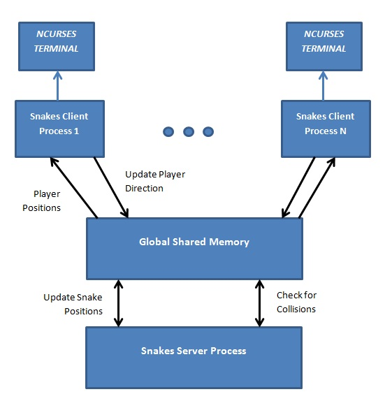

Multiplayer Snakes for UNIX Consoles
====================================

Controls
-----------

The controls of the game can be changed from the game.h file
under the respective constants.

* UP    - W
* LEFT	- A
* RIGHT	- D
* DOWN	- S

Customizing Game Settings
-------------------------

Various game constants such as game speed, maximum players, controls, score information
etc can be edited and changed from the **game.h** and **connection.h**

Description
-----------

The System at any point in time has 1 server process, 1 segment of shared memory
and at least 1 client process. There may be several client processes, 
but for the sake of keeping the screen from being overcrowded, a limit of 8 is kept. 
This limit can easily be changed in game.h (MAX_PLAYERS)

The server process is responsible for the handling of all the game logic in the system.
During each game loop, the server will 

1. Update the active snake positions depending on the direction they are facing
2. Check for any collisions. If any collisions are found, the respective player is killed
3. Generate fruit at random points at random intervals

All the game information is stored in a portion of shared memory which all processes related
to the game have access to. If a process wishes to write to a portion of shared memory which is
accessed by all processes, it will need to acquire access to a semaphore, which helps remove
race conditions.Shared memory is divided into 1 section containing game and server information, and an
array of player structures which contains information about the appropriate player and its snake.

The client process is a very simple process which only reads input from the users keyboard
and draws the information which is shared memory onto the clients terminal (The analogy is the client 
process being a dumb terminal with the snakes process being a mainframe server).

Further detials on the game structure can be found in game.h and game.c

Connection.h and Connection.c contains a group of methods related to connecting to IPC structures
such as shared memory and semaphores.

Optimisations
-------------

the snakes in the game are represented by an array of x,y coordinates and a head variable. 
In order for the snake to move forward one space, the head variable which points to the head of the snake 
just needs to be moved forward one space and the new cell updated depending on the snakes direction. This
allows for quick updating of player snakes and removes the need for complicated data structures such as a
link list of nodes to be used.

Known Bugs
----------

On rare occassions, the client process wont start until another client process joins the game
